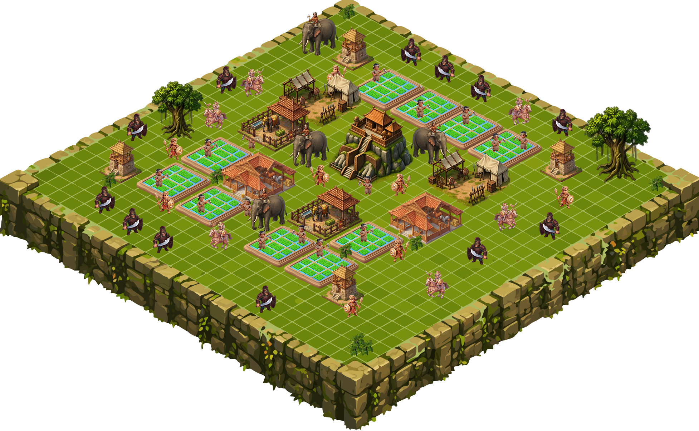

# 👑 APEX-LION

 

**APEX-LION** is a web-based isometric base-building and tower defense game. Defend your kingdom atop the legendary rock fortress by managing resources, constructing buildings, and commanding your troops against increasingly difficult enemy waves.

### 🎮 Play the Game
[Click here to play APEX-LION!](https://vihangamahagamage.github.io/APEX-LION/)

### ✨ Features
* **Isometric Grid System:** Build and place structures strategically on an isometric map.
* **Resource Management:** Collect Gold and Rice to fund your empire.
* **Base Building:** Construct Palaces, Paddy Fields, Barracks, Elephant Pens, Stables, Towers, and Fortified Walls.
* **Dynamic Combat:** Train Villagers, Soldiers, War Elephants, and Horses to automatically engage enemy forces.
* **Wave-based Survival:** Survive as many levels as possible against increasingly stronger enemy AI.
* **Save & Load System:** Your kingdom's progress is automatically saved in your browser.

### 🛠️ Technologies Used
* **HTML5 Canvas:** For rendering the game world and entities.
* **Vanilla JavaScript:** Core game logic, object-oriented mechanics, pathfinding (A* Algorithm), and game loop.
* **CSS3:** For UI styling and responsive design.

